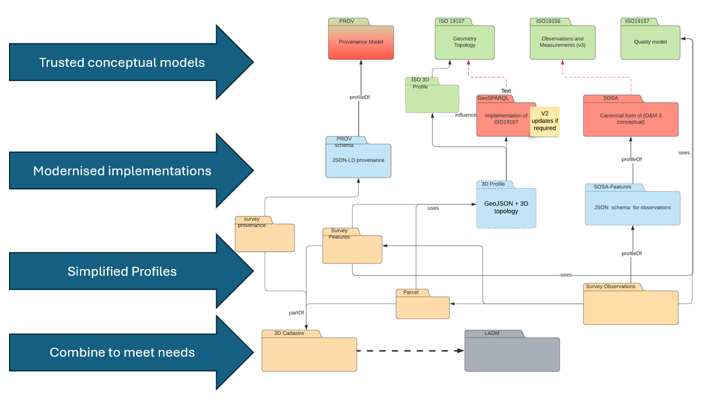
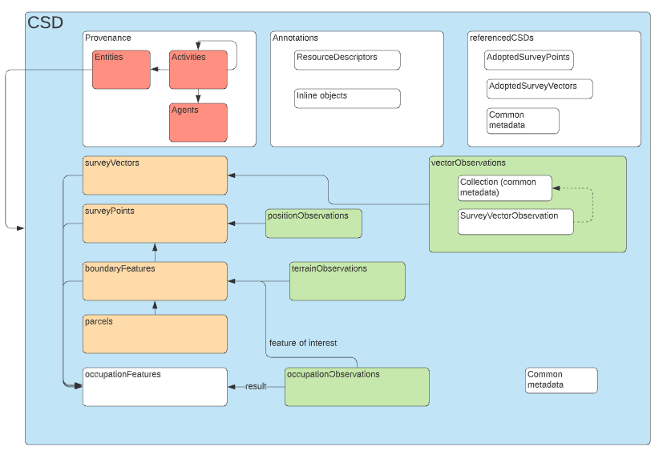

## Cadastral Survey Data Exchange 

A FG-JSON (and hence GeoJSON) compatible encoding of the 3D Cadastral Survey Data Model. 

This model comprises a series of modules based on standardised patterns, such as ISO 19109 General Feature Model, ISO 19156 Observations and Measurements, W3C Provenance Vocabulary.

Each of these modules is described independently and is implemented as a complete building block either within the directory structure of this repository or connected (as a git submodule).

> This encoding uses the OGC "semantic uplift" aproach to bind simple, reusable JSON schema elements to the underlying data models using a JSON-LD context. Implementers do not need to understand this annotation mechanism, however it automatically provides for unambiguous semantics and documentation of data conformant to the encoding schema.

The structure of this is a container object with a set of metadata properties and collections of features and observations.  Observations are grouped as ObservationCollections to minimise duplication of information.

